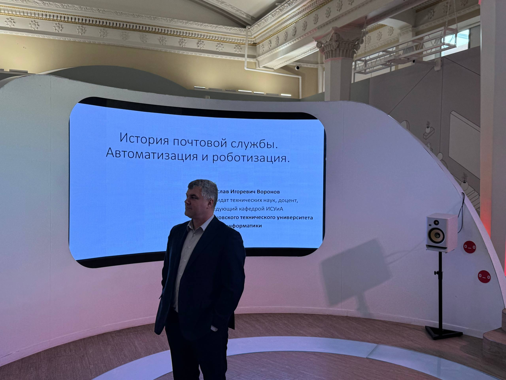
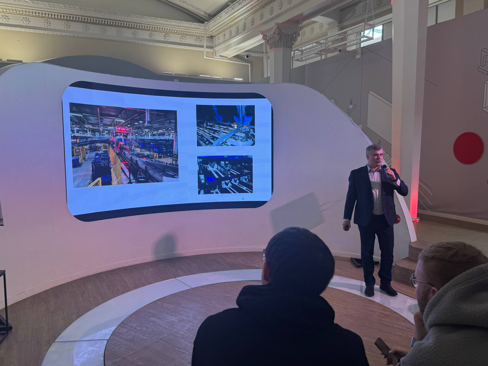
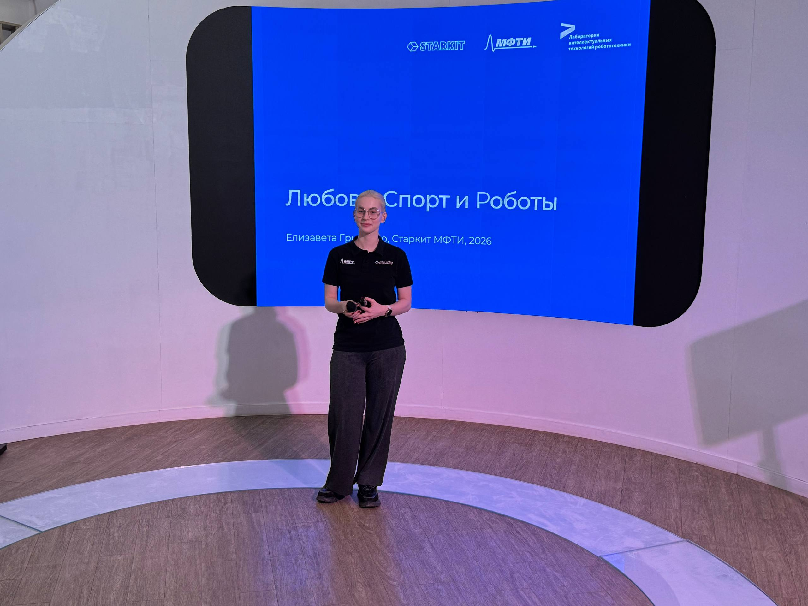
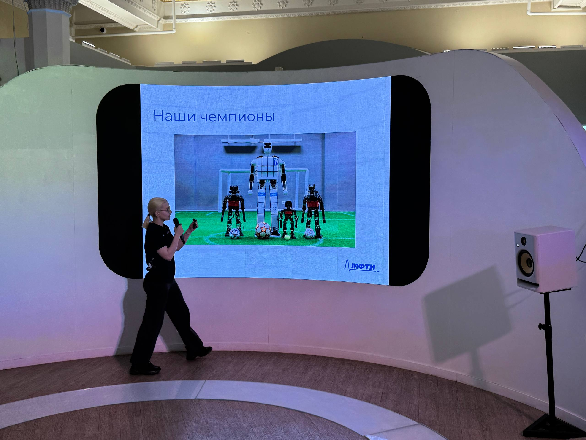
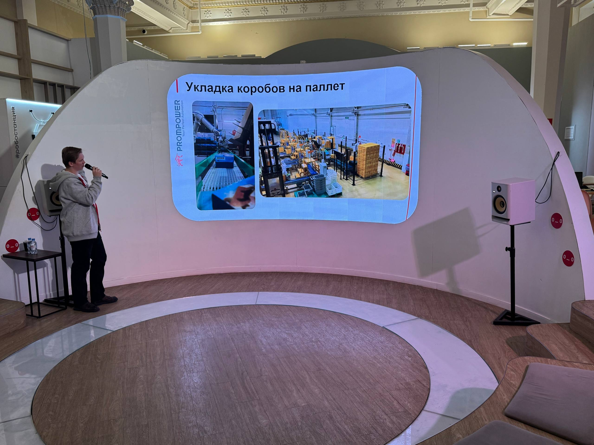
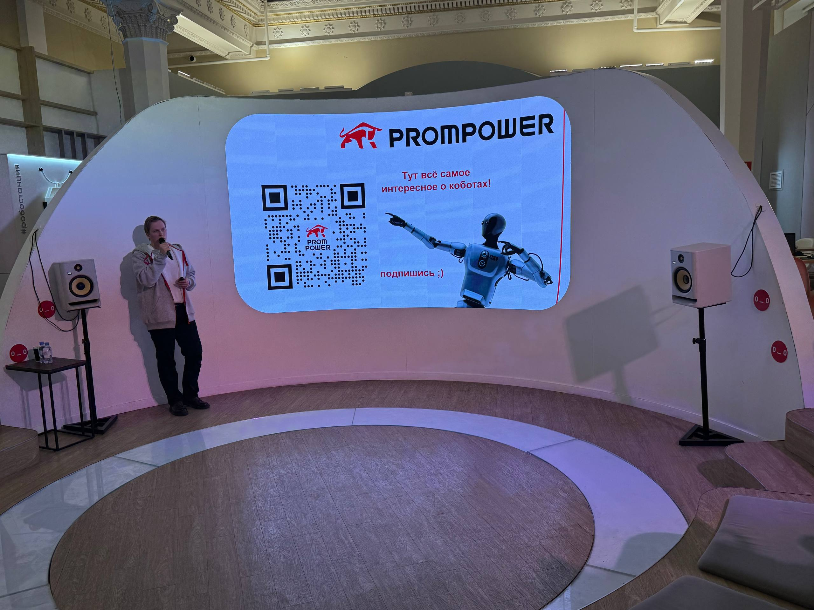

# Взаимодействие с профильной организацией
Посещение лекций на Робостанции 
## 12:00 — Вячеслав Воронов, МТУСИ, заведующий кафедрой, кандидат технических наук, доцент. Тема выступления: «История автоматизации и роботизации почтовой связи».
 
  
## 13:00 - Елизавета Гриненко, программист лаборатории интеллектуальных технологий робототехники МФТИ, специалист по гуманоидной робототехнике, член команды STARKIT. Тема выступления: «Любовь, спорт и роботы».
   
## 14:00 — Дмитрий Калякин, менеджер по развитию бизнеса, PROMPOWER. Тема выступления: «Что такое коботы и где они работают в реальной жизни?»
 